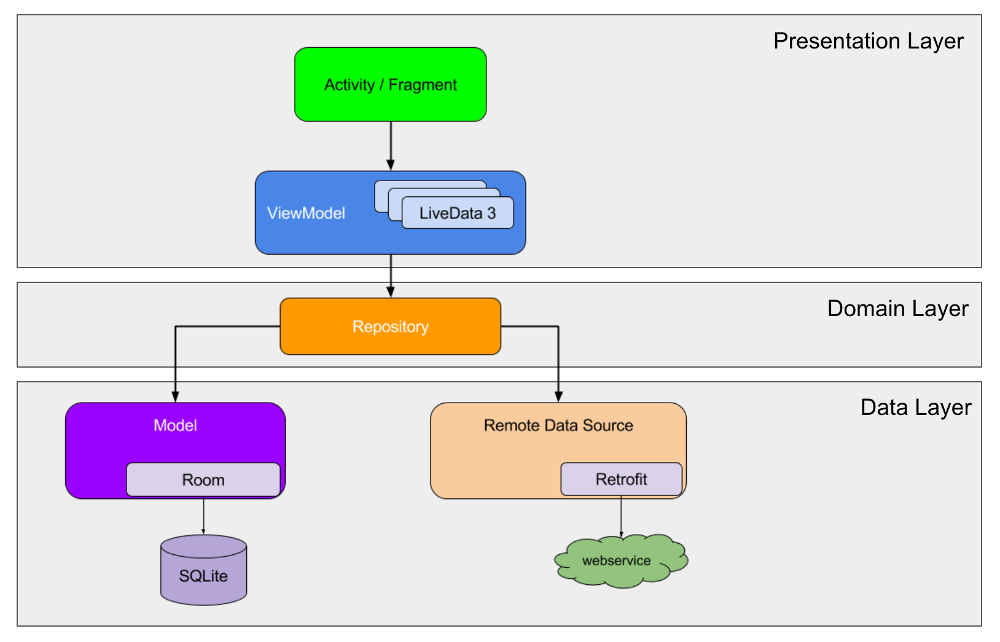

## Google Books API를 활용한 도서 검색 앱

### 기능 목록

- 입력한 검색어에 기반하여 도서 검색 결과 리스트 노출.
- 리스트 아이템 클릭시 상세 정보 링크 이동.

### 개발 환경

----

### Architecture

MVVM + 클린 아키텍처

----

### 구성 Library

- LifeCycle
- ViewBinding
- Retrofit2
- Glide
- Dagger-hilt
- Coroutines
- Timber

----

### Project Review

- 안드로이드 아키텍처 가이드에 기반하여 View와 Model의 관심사를 분리하기 위해 `MVVM 패턴`을 적용하였고, `클린 아키텍처` 적용을 위해 Layer간를 나누어 모듈별로 분리하였습니다.   
      

- ViewModel 클래스는 AAC의 상태 홀더 클래스지만 MVVM의 ViewModel의 역할을 수행하기 위해 1:N의 관계를 가져도 문제가 없도록 안드로이드 프레임워크에 최대한 독립적이게 만들었습니다.   

- 제약 조건에 따라 `Paging3`와 `DataBinding`을 사용하지 않았습니다. 단, 이에 따라 Activity 클래스의 코드가 불가피하게 증가하는 부분을 줄이고자 View Extension 함수들을 사용했습니다.   

   
- Domain, Data Layer간 데이터 맵핑 기능에 대한 Unit Test를 작성했습니다.   

----

### 유저 시나리오

1. 사용자가 `입력` 필드에 검색어를 입력합니다.
2. 사용자가 검색어를 검색하면 `검색어가 포함된 책 목록을 리스트`로 표현합니다.
3. 사용자는 검색된 `도서 수`와 `전체 결과`를 스크롤 하여 모두 볼 수 있습니다.
4. 리스트의 하단에 도달했을 경우 `다음 페이지`를 불러옵니다.
